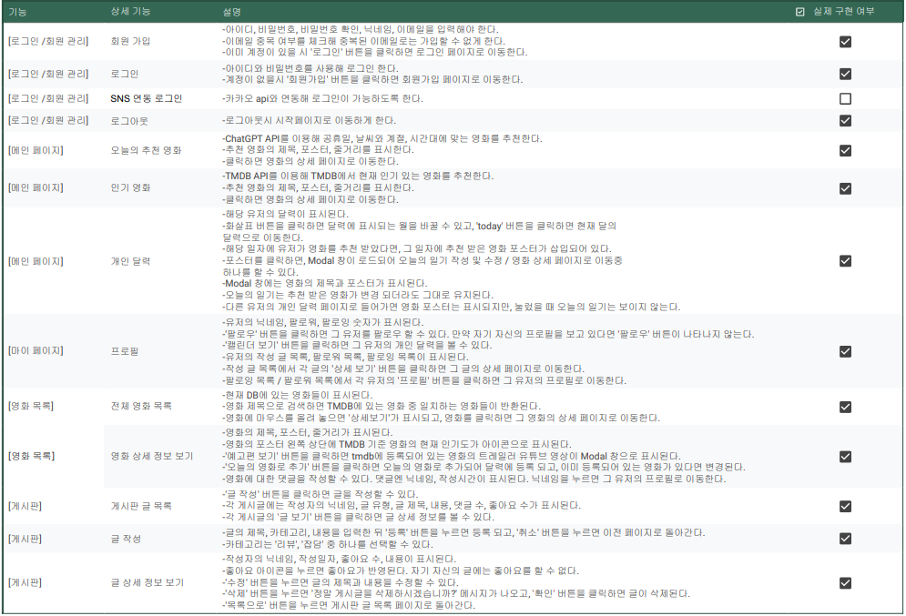

# MIYH

# 매일영화每日映畵MIYH*
## 1. 팀원 정보 및 업무 분담 내역
### 목경민
 - 백엔드 엔지니어링, ERD 작성, API 명세서 작성 담당

### 권인승
 - 프론트엔드 엔지니어링, 페이지 디자인 담당
  
## 2. 목표 서비스 구현 및 실제 구현 정도

## 3. 데이터베이스 모델링(ERD)

## 4. 영화 추천 알고리즘에 대한 기술적 설명
사용자가 두가지 영화 추천을 받을 수 있도록 알고리즘을 만들었다. 사용자가 이전에 선택했던 영화는 추천에 뜨지 않도록 한다. 한국어 제목/줄거리가 지원 되는 영화만 추천에 나오게 한다.

### 4 - 1. '오늘의 영화' 추천 알고리즘
공휴일, 날씨, 시간대 별로 다른 프롬프트를 ChatGPT에게 입력해 영화를 추천하도록 한다. 먼저 오늘이 공휴일에 해당한다면 그 날의 주제에 대한 영화를, 아니라면 날씨와 계절 / 시간대 추천 영화 중 랜덤으로 하나를 추천한다. 

### 4 - 2. '인기 영화' 추천 알고리즘
TMDB에서 인기 있는 영화 중 하나를 추천하도록 한다.

## 5. 핵심 기능에 대한 설명
사용자는 매일 두개의 영화를 추천 받는다. 이 영화 중 하나 혹은 전체 영화 목록에 있는 영화 중 '오늘의 영화로 추가'를 하면 달력에 있는 오늘 일자의 칸에 그 영화의 포스터가 나타난다. 포스터를 누르면 '오늘의 일기'를 작성할 수 있다. 커뮤니티를 통해 다른 유저와 소통할 수 있고, 다른 유저의 프로필을 통해 그 유저의 개인 달력을 볼 수 있다. 

## 6. 생성형 AI를 활용한 부분
Perplexity를 사용했다.

### 6 - 1. 코드 수정
현재 코드와 원하는 동작을 입력하여 코드를 수정하도록 요구했다.

### 6 - 2. ERD 생성
모델을 입력하고 dbdiagram 코드로 만들도록 지시했고, 이것을 dbdiagram 사이트에 입력해 ERD 이미지를 만들었다.

## 7. 후기
### 목경민
"그 동안 배웠던 걸 토대로 진행하는 프로젝트는 우여곡절이 정말 많았지만(9일간의 응축 버전으로), 결과물로 나온 사이트를 처음 들어갈 때의 느낌은 정말 좋았습니다. 말과 글로만 들었던 정리의 중요성을 특히나 느꼈습니다. 5개월 동안의 마무리라고 생각하니 몇 개의 마음이 교차합니다. 너무너무 수고해준 페어 인승이한테 고맙다! 라는 마음을 전하면서... 프로젝트는 계속 이어집니다. 매일영화!"

### 권인승
"VUE를 활용한 웹 프론트엔드 개발은 이전의 수업이나 관통 프로젝트와는 매우 다른 경험이었습니다. 9일간의 개발 기간 동안, 처음에는 독립적으로 구상하고 구현하는 방식으로 시작했습니다. 하지만 서비스가 점차 확장되고 복잡해지면서, 백엔드 팀원과의 긴밀한 협업이 필요해졌고, 이 과정에서 새로운 도전과제들을 마주하게 되었습니다.
비록 처음 접하는 기술과 협업 과정에서 어려움도 있었지만, 이러한 경험을 통해 실제 웹 프론트엔드 개발에 대한 깊은 이해와 실무적인 역량을 키울 수 있었습니다. 특히 팀 협업의 중요성과 프론트엔드 개발의 실질적인 워크플로우를 배울 수 있는 귀중한 시간이었습니다."
