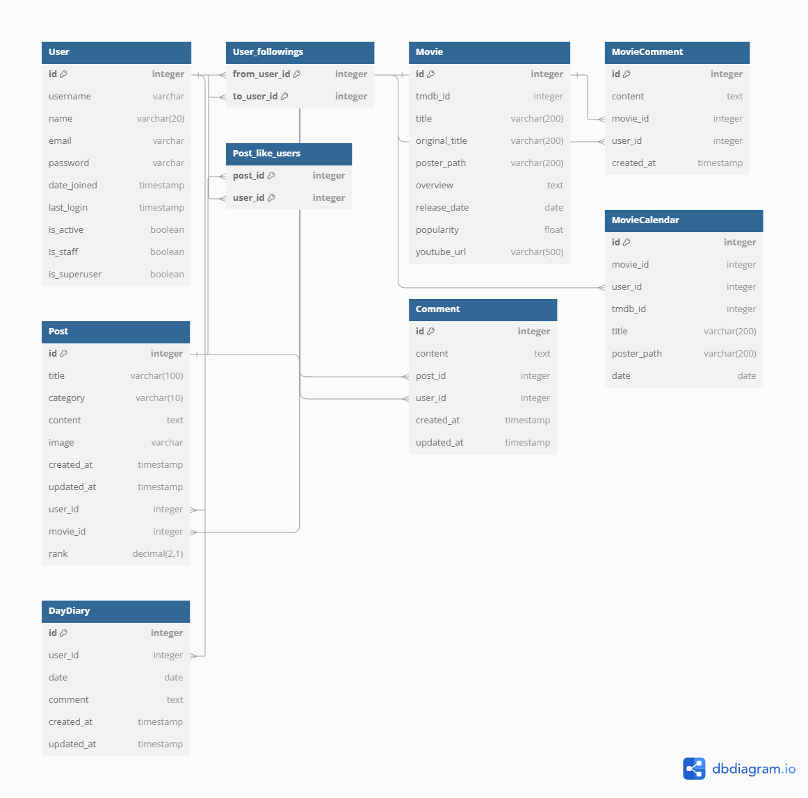
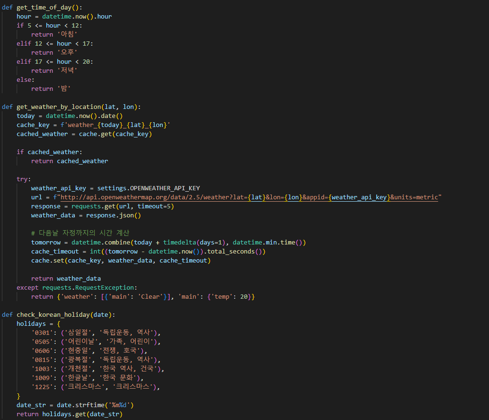
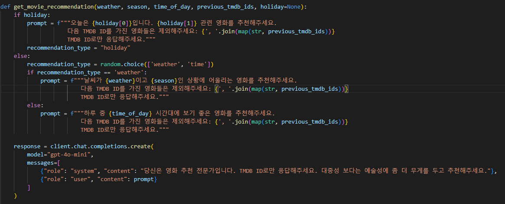
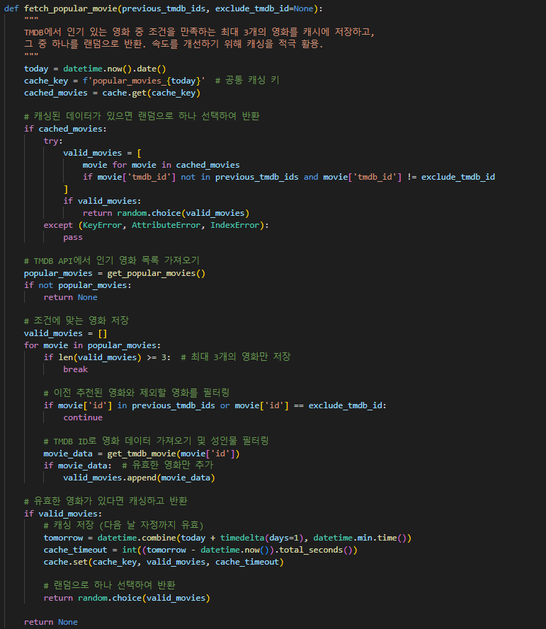
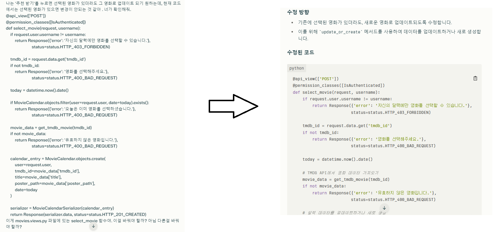
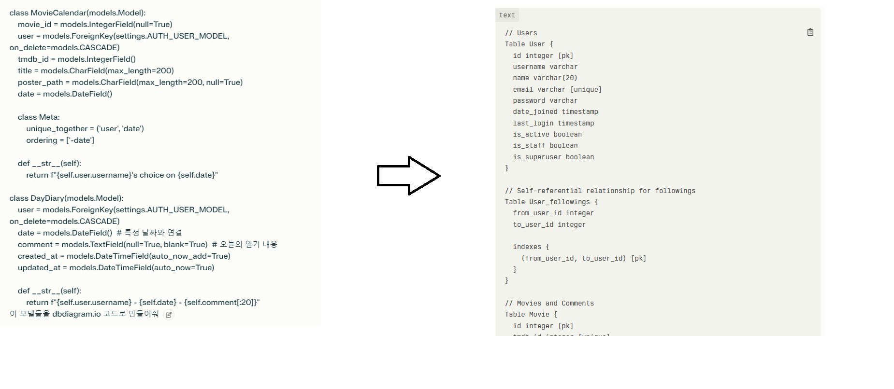

# MIYH

# 매일영화每日映畵MIYH*
## 1. 팀원 정보 및 업무 분담 내역
### 목경민
 - 백엔드 엔지니어링, ERD 작성, API 명세서 작성 담당.

### 권인승
 - 프론트엔드 엔지니어링, 페이지 디자인 담당.
  
## 2. 목표 서비스 구현 및 실제 구현 정도

## 3. 데이터베이스 모델링(ERD)

## 4. 영화 추천 알고리즘에 대한 기술적 설명
사용자가 두가지 영화 추천을 받을 수 있도록 알고리즘을 만들었다. 사용자가 이전에 선택했던 영화는 추천에 뜨지 않도록 한다. 한국어 제목/줄거리가 지원 되는 영화만 추천에 나오게 한다.

### 4 - 1. '오늘의 영화' 추천 알고리즘
공휴일, 날씨, 시간대 별로 다른 프롬프트를 ChatGPT에게 입력해 영화를 추천하도록 한다. 먼저 오늘이 공휴일에 해당한다면 그 날의 주제에 대한 영화를, 아니라면 날씨와 계절 / 시간대 추천 영화 중 랜덤으로 하나를 추천한다. 

### 4 - 2. '인기 영화' 추천 알고리즘
TMDB에서 인기 있는 영화 중 하나를 추천하도록 한다.

## 5. 핵심 기능에 대한 설명

## 6. 생성형 AI를 활용한 부분
Perplexity를 사용했다.

### 6 - 1. 코드 수정
현재 코드와 원하는 동작을 입력하여 코드를 수정하도록 요구했다.

### 6 - 2. ERD 생성
모델을 입력하고 dbdiagram 코드로 만들도록 지시했고, 이것을 dbdiagram 사이트에 입력해 ERD 이미지를 만들었다.

## 7. 후기

